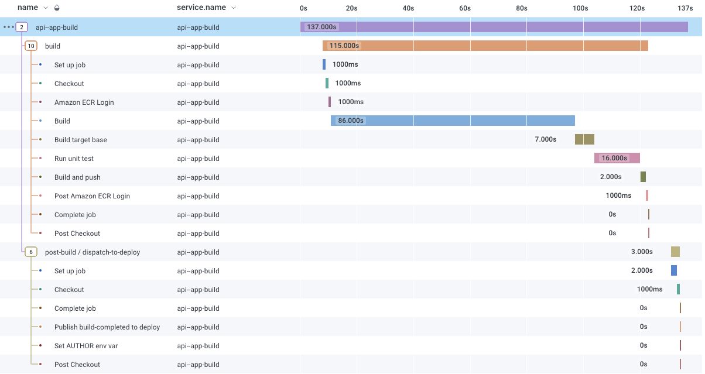

# Open Telemetry Trace Exporter Action

This action will export GitHub Workflow telemetry data using OTLP to a configurable endpoint.

## Usage

### On workflow_run Event

```yaml
name: OpenTelemetry Export Trace

on:
  workflow_run:
    workflows: [my-workflow]
    types: [completed]

jobs:
  otel-export-trace:
    name: OpenTelemetry Export Trace
    runs-on: ubuntu-latest
    steps:
      - name: Export Workflow Trace
        uses: inception-health/otel-export-trace-action@latest
        with:
          otlpEndpoint: grpc://api.honeycomb.io:443/
          otlpHeaders: ${{ secrets.OTLP_HEADERS }}
          githubToken: ${{ secrets.GITHUB_TOKEN }}
          runId: ${{ github.event.workflow_run.id }}
```

### On Current Workflow

```yaml
name: OpenTelemetry Export Trace

on:
  push:
    branch: [main]

jobs:
  build:
    # Run build steps
  otel-export-trace:
    name: OpenTelemetry Export Trace
    runs-on: ubuntu-latest
    needs: [build] # must run when all jobs are complete
    steps:
      - name: Export Workflow Trace
        uses: inception-health/otel-export-trace-action@latest
        with:
          otlpEndpoint: grpc://api.honeycomb.io:443/
          otlpHeaders: ${{ secrets.OTLP_HEADERS }}
          githubToken: ${{ secrets.GITHUB_TOKEN }}
```

### Action Inputs

| name         | description                                                                    | required | default           |
| ------------ | ------------------------------------------------------------------------------ | -------- | ----------------- |
| otlpEndpoint | The destination endpoint to export OpenTelemetry traces to                     | true     |                   |
| otlpHeaders  | Network Headers for the destination endpoint to export OpenTelemetry traces to | true     |                   |
| githubToken  | The repository token with Workflow permissions. Not required for public repos  | false    |                   |
| runId        | Workflow Run ID to Export                                                      | false    | env.GITHUB_RUN_ID |

## Trace Unique Fields

| name                         | type    | description                                       |
| ---------------------------- | ------- | ------------------------------------------------- |
| name                         | string  | Workflow/Job/Step name                            |
| service.instance.id          | string  | {repo_full_name}/{workflow_id}/{run_id}/{run_num} |
| service.name                 | string  | Github Workflow Name                              |
| service.namespace            | string  | Github Repo Full Name                             |
| service.version              | string  | Github Workflow Run HEAD SHA                      |
| github.workflow_id           | integer | Github Workflow ID                                |
| github.workflow              | string  | Github Workflow Name                              |
| github.workflow_url          | string  | Github Workflow URL                               |
| github.run_attempt           | integer | Github Workflow Run Attempt                       |
| github.run_id                | integer | Github Workflow Run ID                            |
| github.run_number            | integer | Github Workflow Run Number                        |
| github.run_url               | string  | Github Workflow Run URL                           |
| github.author_email          | string  | Github Workflow Run Author Email                  |
| github.author_name           | string  | Github Workflow Run Author Name                   |
| github.conclusion            | string  | Github Workflow Run Conclusion                    |
| github.event                 | string  | Github Workflow Run Event Name                    |
| github.git_refs_url          | string  | Github Workflow Run refs url                      |
| github.head_sha              | string  | Github Workflow Run HEAD SHA                      |
| github.job.id                | float   | Github Job Run ID                                 |
| github.job.name              | string  | Github Job Run Name                               |
| github.job.conclusion        | string  | Github Job Run Conclusion                         |
| github.job.labels            | string  | Github Job Run Labels. Comma separated values     |
| github.job.run_attempt       | integer | Github Job Run Run Attempt                        |
| github.job.run_id            | integer | Github Job Run Run ID                             |
| github.job.runner_group_id   | integer | Github Job Runner Group ID                        |
| github.job.runner_group_name | string  | Github Job Runner Group Name                      |
| github.job.runner_name       | string  | Github Job Runner Name                            |
| github.job.step.conclusion   | string  | Github Step Run Conclusion                        |
| github.job.step.name         | string  | Github Step Run Name                              |
| github.job.step.number       | integer | Github Step Run Number                            |

## Honeycomb Example Trace


